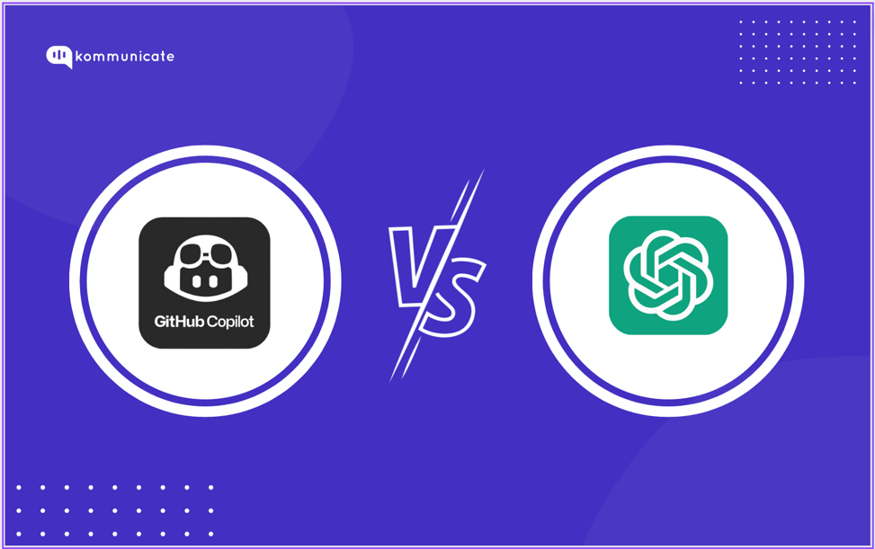

## AI: The Newest Tool in the Software Engineering Toolbox

## Introduction
AI is one of the fastest-growing technologies in software engineering. Just a few years ago, it struggled to create accurate images; now it can generate realistic videos convincing enough to fool me at first glance.

## How I Used AI in ICS 314

### Experience WODs (e.g., E18)
I used AI to help fill in methods when I didn’t know the exact syntax. In E18, which involved array methods, I knew what I wanted the code to do but didn’t know how to express it correctly in JavaScript. Copilot helped translate my ideas into working code.

### In-class Practice WODs
Because these were timed, I often used AI to quickly resolve small issues or formatting problems. This helped reduce my overall completion time.

### In-class WODs
Time pressure made AI helpful for catching small mistakes and improving formatting so I could work more efficiently.

### Essays
For essays, I used ChatGPT mainly for proofreading. It improved the flow of my writing and suggested small additions or edits to make ideas clearer.

### Final Project
I used Copilot to better understand my teammates’ code. It helped me read unfamiliar sections and understand how different parts of the project worked together.

### Learning a Concept / Tutorial
I frequently asked AI to explain new concepts in different ways or through analogies. Interacting with examples helped topics click when they didn’t immediately make sense.

### Answering a Question (Class or Discord)
I did not use AI to answer questions in class or on Discord. In class, I tried to think through answers myself, and I did not ask questions on Discord.

### Asking or Answering a Smart Question
Similarly, I did not rely on AI for asking or answering smart questions in class or on Discord.

### Coding Examples
I used Copilot for examples of specific methods when I wasn’t familiar with them or needed a quick reference.

### Explaining Code
During the final project, Copilot helped me understand and explain teammates’ code, especially when I hadn’t written it myself.

### Writing Code
I used both Copilot and ChatGPT to help write code when I knew the logic but needed help implementing it correctly.

### Documenting Code
I didn’t rely on AI much for documenting code beyond general explanations, since I didn’t do extensive documentation.

### Quality Assurance (ESLint, etc.)
When copying code, I used Copilot to help fix ESLint errors or identify what was wrong.

### Other Uses
Overall, AI was a helpful support tool throughout ICS 314—for understanding code, learning new concepts, and working more efficiently under time constraints.

## Impact on Learning and Understanding
AI helped me learn new concepts faster. Being able to request examples—and then interact with them—was especially useful. However, AI-generated code still requires careful review to ensure accuracy.

## Practical Applications
In real-world development, AI can improve efficiency by generating starter code, scaffolding ideas, and speeding up repetitive tasks like fixing ESLint errors or writing boilerplate.

## Challenges and Opportunities
AI sometimes misunderstands context or produces incorrect code. Providing enough context is especially hard when multiple files depend on each other; sharing just one file is often not enough for AI to solve an issue.

## Comparative Analysis
AI improves the learning process in computer science by acting like an always-available assistant you can query with specific questions. While teachers are invaluable, AI’s breadth and immediacy make it a powerful complement.

## Future Considerations
For students entering software engineering, knowing how to use AI is becoming a baseline skill. We’re not at the point where AI can replace human review, so we still need engineers to verify and approve code.

## Conclusion
My experience using AI in ICS 314 showed that it is a powerful support tool for both learning and productivity when used responsibly. AI helped me understand new concepts more quickly, work efficiently under time constraints, and contribute more effectively to team projects through examples, explanations, and debugging assistance. Reviewing AI-generated code remains essential, since AI can produce incorrect or incomplete solutions when context is limited. Going forward, courses should teach effective prompting, evaluation, and verification of AI outputs while reinforcing critical thinking and code review skills. Combined with sound engineering judgment and strong fundamentals, AI can significantly enhance the learning experience in software engineering.
