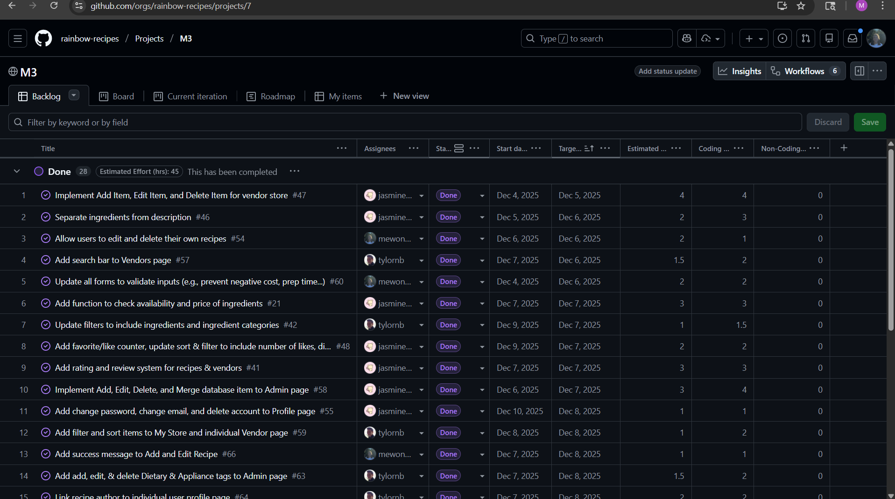

## From Homework to Final Project: Estimating Effort
For the ICS 314 final project I made my effort estimates based on previous experiences such as homeworks and WODs. For example for making an add or edit recipe form, this was very similar to homework assignments that we had for adding and editing Stuff. So based on my time for the homework assignments I assumed it would be a similar time for the final project. I always added extra time to my estimates just in case something unexpected happens in the code or in my schedule. For issues that I hadn’t had any experience with I just made a guess and gave myself a time slot so my teammates knew it might take some time. For example, one of the issues was creating a favorites recipes page, I hadn’t done something similar before so I estimated 3 hours of effort. I ended up only using 1 hour, but it’s always better to finish something early than late.

Estimating efforts helped a lot because it helps us know when we need to start on issues to finish in time and plan ahead. Looking at all the issues first also helps us know which ones are a priority as well. For example, in M3 there were a lot of issues we had to finish first like making instructions and ingredients separate fields before we could add sample recipes. I used a stopwatch on Google to time myself and if I didn’t finish in one sitting I would record my time and add to it later. This was pretty accurate because I was controlling the stopwatch myself.

I didn’t use any AI to estimate my effort because I think it would be hard for AI to know my abilities and put that into account for the effort estimates. I think it differs for each person so I decided to use my past experiences for a more accurate estimate.

