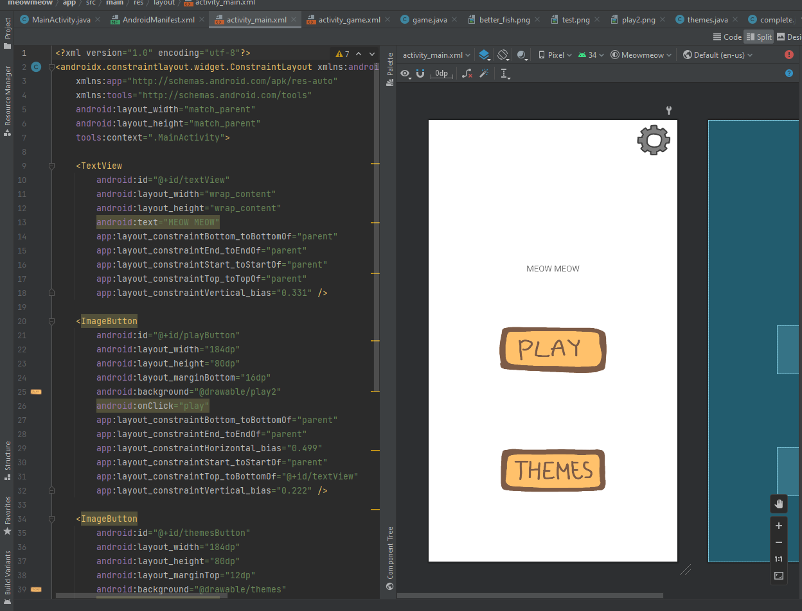
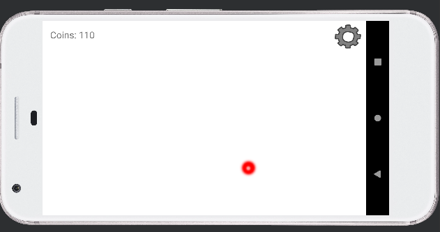

  
  

I developed an Android app designed as an interactive game for cats, simulating the fun of chasing a laser pointer. The app displays a moving red dot that responds to touch input, each time the cat successfully taps the dot, a meow sound is triggered and the laser instantly relocates to a random spot on the screen. Everytime the laser pointer is touched, coins are earned and can be used to buy different pointers, like a fish or yarn.

The project was built using Android Studio where I used JavaScript and XML. I implemented event detection, randomization logic for movement, and integrated audio playback to enhance user feedback. I also created all the buttons in the game to customize the look of the app.

